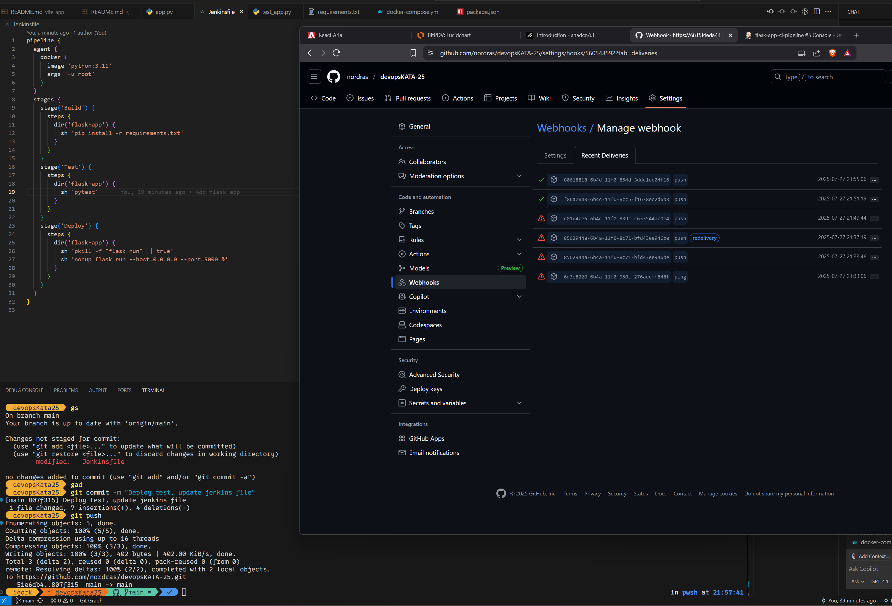

# devopsKATA-25

Objetive is to be able to deploy an application with all this tools and you need 2 clusters (or2 namespaces) one for the infra and other for the apps that will be deployed. 
The pipelines in Jenkins need to run tests and fail if tests fail.
OpenTofu need to have automated tests as well, all apps deployed need to be integrated with Grafana and Prometheus by default.

* **Jenkins** - Jenkins is an open-source automation server used to automate tasks in software development, particularly for building, testing, and deploying software.
* **Helm** - Helm is a package manager for Kubernetes
* **OpenTofu** - Terraform fork
* **Minikub** or other kubernetes cluster manager - Minikube is local Kubernetes, focusing on making it easy to learn and develop for Kubernetes. All you need is Docker (or similarly compatible)
* **Prometheus** - An open-source monitoring system with a dimensional data model, flexible query language, efficient time series database and modern alerting approach.
* **Grafana** - Monitoring tool

### kata history 
25 JUL 2025
Run a Jenkins instance using Docker
Create a multi step pipeline (Build, Test) that builds and run unit tests for a simple Flask app (this project should be in a Github repo)
Jenkins should run the pipeline when a merge is done in main branch

29 JUL 2025
Make Jenkins deploy the Flask app to Minikube using Helm
Setup minikube locally
Create a Helm Chart for the Flask App
Update Jenkins pipeline to add a new stage deploy

Status 27/07


Status 28/07
Meeting summary:
Most of the team ran Jenkins locally and was able to run the pipeline for Flask App
Those who didn't finish will finish by Monday EOD
Solutions are very similar
Doubt: Should the projects (like the flask app) have a Dockerfile (besides the Jenkinsfile), since they will probably need its own image to be further deployed in k8s? @gnogueira can you help us with this question?

```
Each app (like the Flask app) should have its own Dockerfile
The Dockerfile is responsible for building the apps container image, which is required to run it in k8s
The Jenkinsfile handles the CI/CD pipeline (e.g build, test, deploy), but it still needs a Dockerfile to actually build the image
So in short:
Dockerfile -> defines how the app image is built
Jenkinsfile -> automates the process (build, test, push, deploy)
Kubernetes -> runs the built image

check https://www.baeldung.com/ops/docker-local-images-minikube
```

deploy test2
